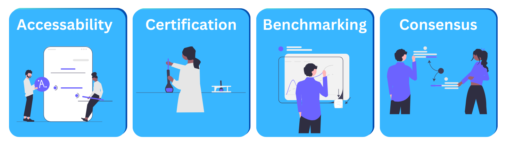

# Integrating AI and Blockchain: Developing AI Standards for Cardano

Welcome to the repository for **"Integrating AI and Blockchain: Developing AI Standards for Cardano"**. This project explores the intersection of AI and blockchain technology, establishing AI standards for the Cardano ecosystem.

## Overview

We define key principles for integrating AI with the Cardano blockchain. 

## Four Pillars of AI Integration

Our research focuses on the following four foundational pillars:

1. **Accessibility**  
   Ensuring AI models are easily accessible via APIs.
   
2. **Model Certification**  
   Establishing certification protocols to ensure the credibility and reliability of AI models on the blockchain.

3. **Benchmarking**  
   Developing standards to measure and benchmark the performance of AI models in a decentralized environment.

4. **Consensus**  
   Introducing mechanisms for consensus and verification of AI model outputs.

## Research Proposal

To read more about this project, please refer to our research proposal.

[**Click here to read the full research proposal**](1200134_Integrating_AI_and_Blockchain.pdf)
